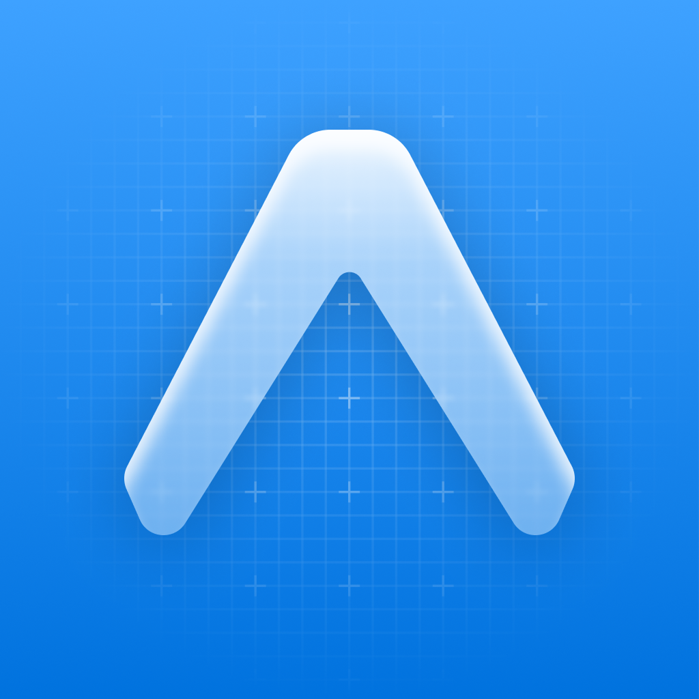

<h1 align="center">
  <br/>
Mobile App </h1>

> This Project is based on [Obytes starter](https://starter.obytes.com)

## Requirements

- [React Native dev environment ](https://reactnative.dev/docs/environment-setup)
- [Node.js LTS release](https://nodejs.org/en/)
- [Git](https://git-scm.com/)
- [Watchman](https://facebook.github.io/watchman/docs/install#buildinstall), required only for macOS or Linux users
- [npm](https://docs.npmjs.com/) (bundled with Node.js)
- [Cursor](https://www.cursor.com/) or [VS Code Editor](https://code.visualstudio.com/download) ⚠️ Make sure to install all recommended extension from `.vscode/extensions.json`

## 👋 Quick start

Clone the repo to your machine and install deps :

```sh
git clone https://github.com/user/repo-name

cd ./repo-name

npm install
```

To run the app on ios

```sh
npm run ios
```

To run the app on Android

```sh
npm run android
```

## ✍️ Documentation

This repo ships self-contained docs:

- [DOCUMENTATION.md](./DOCUMENTATION.md) — reference: stack, structure, config, commands, components, type-safe API, testing, conventions
- [GUIDE.md](./GUIDE.md) — guides: navigation, auth, data fetching, i18n, upgrading, storage, UI, forms
- [Live HTML version](https://9qa062832ngrzt64r5wy0aphamfng9vq.pastehtml.dev/) — both docs combined in one page

Upstream Obytes starter docs:

- [Rules and Conventions](https://starter.obytes.com/getting-started/rules-and-conventions/)
- [Project structure](https://starter.obytes.com/getting-started/project-structure)
- [Environment vars and config](https://starter.obytes.com/getting-started/environment-vars-config)
- [UI and Theming](https://starter.obytes.com/ui-and-theme/ui-theming)
- [Components](https://starter.obytes.com/ui-and-theme/components)
- [Forms](https://starter.obytes.com/ui-and-theme/Forms)
- [Data fetching](https://starter.obytes.com/guides/data-fetching)
- [Contribute to starter](https://starter.obytes.com/how-to-contribute/)
